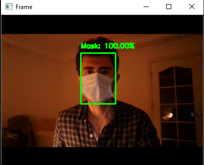

# `Mask-Detection`
The purpose of this project is to develop an application that automatically checks whether 
people are wearing masks. The application is planned to be used to control whether there is a 
mask on the supervised faces by creating a deep learning model. 2000 masked and 2000 
unmasked data from Github were used to train the model. Many frameworks such as tensorflow, 
keras, numpy, opencv have been used.

## Tech and Libraries

- OpenCV
- Numpy
- Keras
- TensorFlow
- MobileNetV2

## Dataset

 - [RMFD dataset](https://github.com/X-zhangyang/Real-World-Masked-Face-Dataset)

## Screenshots

|  |
| :--:|
| *Output with Mask* |

